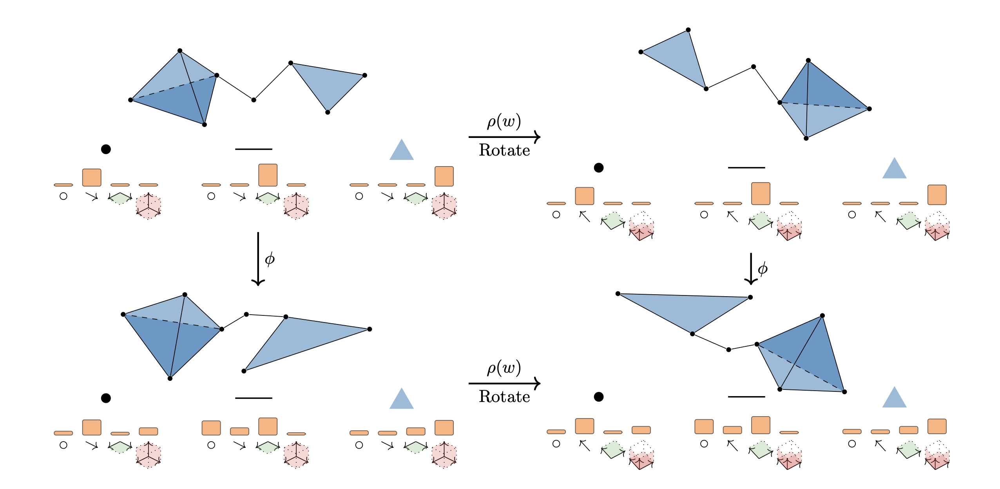

# [Clifford Group Equivariant Simplicial Message Passing Networks (ICLR 2024)](https://arxiv.org/abs/2402.10011) 


**Authors**: Cong Liu*, David Ruhe*, Floor Eijkelboom, Patrick Forré

* [Paper Link](https://arxiv.org/abs/2402.10011)

## Abstract
We introduce Clifford Group Equivariant Simplicial Message Passing Networks, a method for steerable E(n)-equivariant message passing on simplicial complexes. Our method integrates the expressivity of Clifford group-equivariant layers with simplicial message passing, which is topologically more intricate than regular graph message passing. Clifford algebras include higher-order objects such as bivectors and trivectors, which express geometric features (e.g., areas, volumes) derived from vectors. Using this knowledge, we represent simplex features through geometric products of their vertices. To achieve efficient simplicial message passing, we share the parameters of the message network across different dimensions. Additionally, we restrict the final message to an aggregation of the incoming messages from different dimensions, leading to what we term shared simplicial message passing. Experimental results show that our method is able to outperform both equivariant and simplicial graph neural networks on a variety of geometric tasks.

## Code Organization
* `csmpns/`: contains the core code snippets.
  * `algebra/`: contains the Clifford Algebra implementation.
  * `configs/`: contains the configuration files. 
  * `data/`: contains necessary (simplicial) data modules.
  * `models/`: contains model and layer implementations.
* `engineer/`: contains the training and evaluation scripts.

## Requirements and Conda Environment
* Requirement: See `environment.yml`
* Create Conda Environment: `conda env create -f environment.yml`

Run `mkdir ./datasets/` to generate a folder for storing datasets of experiments
This implementation uses conda environment, change the path of `miniconda/` in `activate.sh` to your local `miniconda/` path and run `sh activate.sh`.

Run `pip install -e .`

## Datasets
#### Convex Hulls Volume
Convex hulls datasets are generated by running `python csmpn/data/hulls.py`.

#### Human Walking Motion
Human walking motion datasets are from [here](https://github.com/hanjq17/GMN). Please copy `spatial_graph/motion/motion.pkl` and `spatial_graph/motion/split.pkl` to `./datasets/`.

#### MD17 Atomic Motion
MD17 atomic datasets are from [here](http://quantum-machine.org/gdml/#datasets). Please run `mkdir ./datasets/md17/` and download corresponding molecules to `./datasets/md17/`. Run `python csmpn/data/modules/preprocess_md17.py` to preprocess downloaded `.npz` files.

#### NBA Players Trajectory 
NBA players trajectory datasets are from [here](https://www.dropbox.com/s/dl/reibyhs7wmeoqc1/bsk_all_data.zip). Please run `mkdir ./datasets/nba/` and download corresponding file to `./datasets/nba/`. Run `python csmpn/data/modules/preprocess_nba.py --players [atk | def]` to preprocess downloaded `.npy` file.


## Experiments

#### Convex Hulls Volume Prediction:  
`sweep_local csmpn/configs/hulls.yaml` 

#### Human Walking Motion Prediction:
`sweep_local csmpn/configs/motion.yaml`

#### MD17 Atomic Motion Prediction:
`sweep_local csmpn/configs/md17.yaml`

#### NBA Players trajectory Prediction:
`sweep_local csmpn/configs/nba.yaml`

## Citation:
If you found this code useful, please cite our paper:

```
@misc{liu2024clifford,
  title={Clifford Group Equivariant Simplicial Message Passing Networks},
  author={Cong Liu and David Ruhe and Floor Eijkelboom and Patrick Forré},
  year={2024},
  eprint={2402.10011},
  archivePrefix={arXiv},
  primaryClass={cs.AI}
}
```


